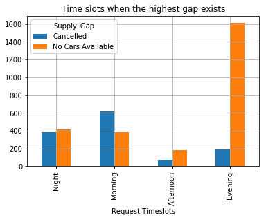

# Data Science Project
The projects in this repository are few of the academic project done for my diploma degree in Data Science.

#### 1. [Uber Assignment](https://github.com/snozh5/Data-Science-Project/blob/main/Uber%20Assignment.ipynb)
<b>Problem Statement:</b> The aim of analysis is to identify the root cause of the problem (i.e. cancellation and non-availability of cars) and 
recommend ways to improve the situation. As a result of the analysis, one should be able to present to the client the root cause(s) and possible 
hypotheses of the problem(s) and recommend ways to improve them.
 
 
<b>Solution:</b>

  
  

The above bubble plot shows the most pressing problem for Uber is No Cars Available at the Airport and the time is mostly evening hour from the bar graph we can conclude.

Some of the ways to resolve the issue:-
- Increase the number of cars available the customers.
- Increase the radius of the map for the app during the pick hour i.e. evening in the airport.
- Communication should be done with the driver so that they can be available at airport during the evening timeslot and make themselves available.

#### 2. [Car Price Prediction Assignment](https://github.com/snozh5/Data-Science-Project/blob/main/Assignment-%20Linear%20Regression%20(Geely%20Auto).ipynb)
<b>Problem Statement:</b> The aim of this project is to model the price of the cars which will be used by the management to understand the important KPIs and pricing dynamics of the market.

<b>Solution:</b> For this project since the target variable price is continuous a Linear Regression Model is being trained to find out the important KPIs impacting the price. The matrix used to evaluate the model is R-squared value and for building the model I have used the following technique:
 

  

The above plot shows the Company name of different cars in the dataset. 
<b>_Final Result:_</b>The model achieved a final R-square value of 88% which means the model the will do a decent good job and be able to find out the important KPIs.
 
So after iteration, the final features left are Porsche (Company Name), Rear (Engine Location), Curbweight, Peugeot (Company Name), BMW (Company Name),Twelve (Cylinder Number). These are the important KPIs that are impacting the price of the car and hence the management can use to determine the pricing dynamics of the market. 

#### 3. [House Price Prediction Assignment](https://github.com/snozh5/Data-Science-Project/blob/main/Advanced%20Regression.ipynb)
<b>Problem Statement:</b> The aim of this project is to find out the important variables that affect the price of the house and how those variables describe the price of the house.
 
 
<b>Solution:</b> For this project I have used Ridge and Lasso algorithm which are also known as Advance Regression. What it does is they give us important features after the model is being trained. 
A cross-validation GridSearchCV equal to 10 is used to determine the alpha value. For Ridge Regression alpha equal to 10 came out as best value and for Lasso an alpha vlue of 100.

  

The above plot shows the end result of important features for the Lasso model.
